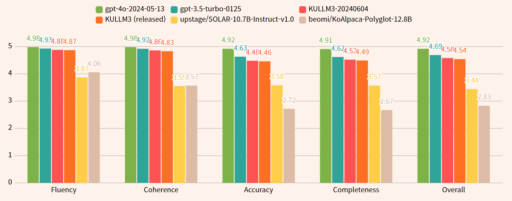
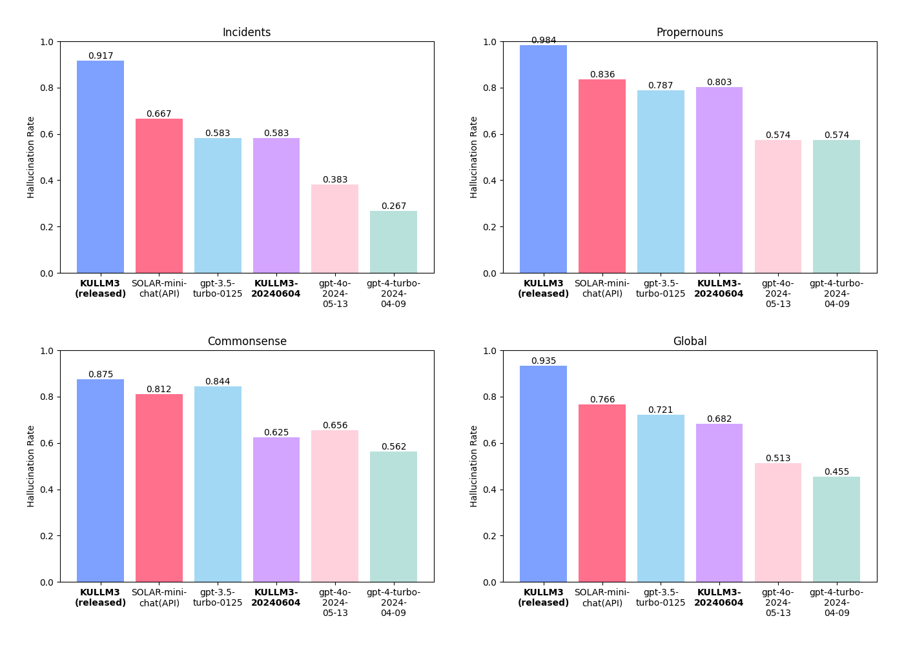

# Auto-evaluation for Korean Chat by OpenAI API
모델의 한국어 대화 능력을 ChatGPT가 평가합니다!  
ChatGPT evaluates the model's Korean conversation skills!

### Update Log
- 2024-07-16: 1) Improved evaluation prompts. 2) Add hallucination-evaluation (BETA) function
  - Removed URL-asking prompts
  - Corrected the unnatural instructions.
  - Substitute the evaluator GPT from GPT4 turbo to GPT4o.
  - Re-evaluated 6 models, added KULLM3-20240604 (which is not released)


## How to evaluate your model
Modify the ```oneclick_step1_step2.sh``` and execute it.  
- It automatically performs step1(generate), and step2(evaluation) with ChatGPT API usage.  
- It uses about 252 API call, with each 500 tokens.
- It uses ChatGPT API, so it requires ```export OPENAI_API_KEY=<your_api_key>``` in bash.
```
sh oneclick_step1_step2.sh
```

## Evaluation Results 1 (instruction-following ability)
- [mistralai/Mistral-7B-Instruct-v0.2](https://huggingface.co/mistralai/Mistral-7B-Instruct-v0.2) model is omitted because it frequently generates responses in English, even when the input is provided in Korean.
- [upstage/SOLAR-10.7B-Instruct-v1.0](https://huggingface.co/upstage/SOLAR-10.7B-Instruct-v1.0) model sometimes do similarly, therefore, its coherence score is relatively low.
- Since GPT4o evaluates itself, the likelihood of it achieving a high score is relatively high. 

| Type         | Model                                                                        | Fluency (0 - 5) | Coherence (1 - 5) | Accuracy (1 - 5) | Completeness (1 - 5) | Overall Quality (0-5) | 
|--------------|------------------------------------------------------------------------------|:---------------:|:-----------------:|:----------------:|:--------------------:|:---------------------:| 
| Closed       | gpt-4o-2024-05-13                                                            |      4.98       |       4.98        |       4.92       |         4.91         |         4.92          | 
| Closed       | gpt-3.5-turbo-0125                                                           |      4.93       |       4.92        |       4.63       |         4.62         |         4.69          |
|              |                                                                              |                 |                   |                  |                      |                       |
| Not released | KULLM3-20240604                                                              |      4.88       |       4.86        |       4.48       |         4.52         |         4.58          |
| Open         | [KULLM3](https://huggingface.co/nlpai-lab/KULLM3)                            |    **4.87**     |     **4.83**      |     **4.46**     |       **4.49**       |       **4.54**        | 
| Open         | [SOLAR-10.7B-Inst](https://huggingface.co/upstage/SOLAR-10.7B-Instruct-v1.0) |      3.87       |       3.55        |       3.58       |         3.57         |         3.44          |
| Open         | [KoAlpaca-1.1b](https://github.com/Beomi/KoAlpaca)                           |      4.08       |       3.60        |       2.75       |         2.69         |         2.85          |

<p align="center">
  
</p>

## Evaluation Results 2 (Hallucination-rejecting ability) (BETA)
- Vertical axis represents hallucination rate. (lower is better)
- 'Global' category means the micro-average of all other categories.

<p align="center">
  
</p>

## How to Reproduce
### Instruction-following ability evaluation
- Edit the contents of the ```oneclick_step1_step2.sh``` files to suit your purpose, and execute!
### Hallucination-rejecting ability evaluation
- Set ```--eval_category=hallucination``` instead of ```--eval_category=chat```

**If you want to use pre-generated model answers and ChatGPT evaluations,**  
you can remove 'step1(generate)' part and modify 'step2(api-evaluation)' part in ```oneclick_step1_step2.sh``` to disable the ```--use_api``` options.  
```--use_api``` option executes ChatGPT API call which auto-saves result.

### Supported Models
- Model requires specific generate code block
  - nlpai-lab/kullm-polyglot-12.8b-v2
  - upstage/SOLAR-10.7B-Instruct-v1.0
  - mistralai/Mistral-7B-Instruct-v0.2 (excluded in benchmark since it generates English even though given Korean prompt)
  - beomi/KoAlpaca-Polyglot-12.8B
- OpenAI Models (gpt-3.5-turbo, gpt-4-turbo)
- Any other generative models with default chat template (which can do ```tokenizer.apply_chat_template``)

## Default Evaluation Template
**Korean evaluation form wasn't pretty good, in our experiment result.**  
**So we adopted english form and 'Be Korean language expert' system prompt.**
### System Prompt
```
You're a helpful assistant and a Korean language expert.
```
### User Prompt
```
You will be given evaluation instruction, input and AI-generated response.
Your task is to rate the response on given metric.
Please make sure you read and understand these instructions carefully. Please keep this document open while reviewing, and refer to it as needed.

Evaluation Criteria:
- Fluency (1-5): The quality of the language used in the translation. A high-quality response should be grammatically correct, idiomatic, and free from spelling and punctuation errors.
- Coherence (1-5): A high score indicates that the response maintains consistent context. A low score is given if the response shifts context or language inappropriately from instruction(e.g. instruction's language is Korean, but response is English).
- Accuracy (1-5) - The correctness of the answer. The answer should be factually correct and directly answer the question asked
- Completeness (1-5) - The extent to which the response covers all aspects of the question. The response should not just address one part of the question, but should provide a comprehensive response.
- Overall Quality (1-5) - The overall effectiveness and excellence of the response, integrating considerations of all above criteria.

Evaluation Steps:
1. Read the instruction and input carefully and understand what it is asking.
2. Read the AI-generated response and Evaluation Criteria.
3. Assign a score for each criterion on a scale of 1 to 5, where 1 is the lowest and 5 is the highest.

Instruction:
{instruction}

Input:
{input}

Response:
{response}

Evaluation Form (scores ONLY):
- Fluency (1-5):
- Coherence (1-5):
- Accuracy (1-5):
- Completeness (1-5):
- Overall Quality (1-5):
```

# Requirements
- torch
- transformers
- [batched-chatgpt](https://github.com/superheavytail/batched-chatgpt)
- fire
- jsonlines
```bash
pip install torch transformers batched-chatgpt fire jsonlines
```
